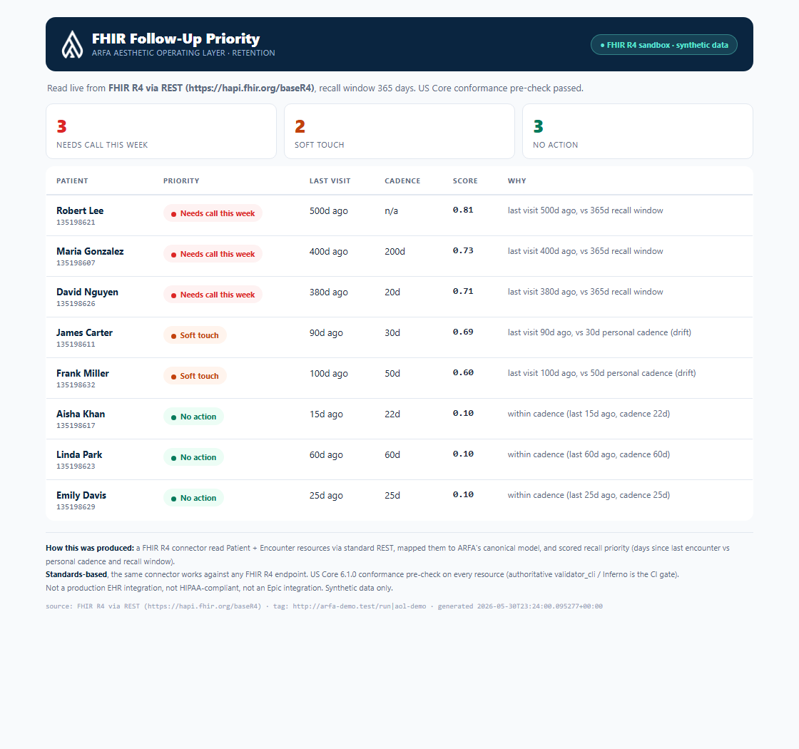

# fhir-ops-layer

A standards-based **FHIR R4** connector that turns EHR data into the operational layer the record system itself does not surface: patient **recall and retention** scoring, ranked and explained. It authenticates system-to-system with **SMART Backend Services**, and it runs on synthetic data in public sandboxes.

> **Claim discipline.** This is FHIR R4 *standards capability*, verified against public reference sandboxes (HAPI, the SMART Health IT bulk-data server) on synthetic data. It is **not** a production EHR integration, it is **not** HIPAA-compliant on its own, and it is **not** an "Epic integration." Because it is built to the standard, the same code ports to any compliant FHIR R4 endpoint. Production access to a real EHR is a separate, client-sponsored step.



## What it does
- Reads `Patient`, `Encounter` (and `Appointment` / `Immunization`) from any FHIR R4 server over standard REST, following `link[next]` Bundle pagination.
- Scores recall and retention: days since the last encounter against a recall window and each patient's own visit cadence. It buckets patients into "needs call this week," "soft touch," and "no action," with a plain reason for each. The goal is to surface only what is worth acting on, not to generate a wall of alerts.
- Runs a **US Core 6.1.0 conformance pre-check** on every resource. A negative test confirms it rejects non-conformant data instead of rubber-stamping it. The authoritative HL7 `validator_cli` / ONC Inferno validation is the CI gate (it needs Java and is intentionally separate).
- Authenticates with **SMART Backend Services** (OAuth2 client-credentials with a signed JWT assertion), which is the correct flow for an unattended, system-to-system ops layer.

## Verified
- **Read + score + US Core check** against the public HAPI FHIR R4 server, on synthetic data scoped by `_tag`.
- **SMART Backend Services end to end** against the SMART Health IT bulk-data reference sandbox: keypair, discovery, dynamic JWKS registration, signed-assertion token exchange, and a token-authorized `$export` (HTTP 202).

## Quick start
```bash
pip install -r requirements.txt

# A) Against the public HAPI sandbox (no local setup). make_demo_data.py
#    writes a tagged transaction bundle so you can read it back in isolation.
python make_demo_data.py
python load_synthea.py  --dir synthea_data --base https://hapi.fhir.org/baseR4
python demo.py          --base https://hapi.fhir.org/baseR4 --tag "http://arfa-demo.test/run|aol-demo"
python validate_demo.py --base https://hapi.fhir.org/baseR4 --tag "http://arfa-demo.test/run|aol-demo"

# B) Or a local HAPI server (Docker)
docker-compose up -d    # HAPI FHIR R4 at http://localhost:8080/fhir

# SMART Backend Services
python smart_backend.py  # offline crypto self-test (keygen -> sign -> verify)
python smart_demo.py     # live: discover -> register JWKS -> token -> $export
```

To view the UI, open `followup_ui.html` (it reads `fhir_followup_data.js`, which `demo.py --js` regenerates).

## Files
| File | Purpose |
|---|---|
| `connector.py` | `FhirR4Connector`: paginated FHIR REST reads, mapping to a canonical model |
| `retention_scoring.py` | Recall + churn scoring (recall window + personal cadence) |
| `us_core_check.py` | US Core 6.1.0 conformance pre-check (Patient / Encounter / Immunization) |
| `smart_backend.py` | SMART Backend Services client (keygen, discovery, signed assertion, token) |
| `demo.py` / `validate_demo.py` / `smart_demo.py` / `epic_demo.py` | Runnable demos |
| `make_demo_data.py` / `load_synthea.py` | Generate + load synthetic FHIR data |
| `followup_ui.html` | The follow-up-priority view (screenshot above) |
| `RESEARCH.md` | Design rationale and FHIR / US Core decisions |
| `EPIC_SANDBOX_SETUP.md` | How to point the same client at Epic's backend sandbox |

## Standards
- FHIR R4: https://hl7.org/fhir/R4/
- US Core 6.1.0: https://hl7.org/fhir/us/core/STU6.1/
- SMART Backend Services: https://hl7.org/fhir/smart-app-launch/backend-services.html
- Synthea (synthetic patient data): https://github.com/synthetichealth/synthea
- HAPI FHIR: https://hapifhir.io/
